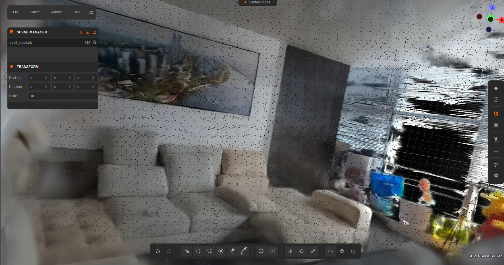
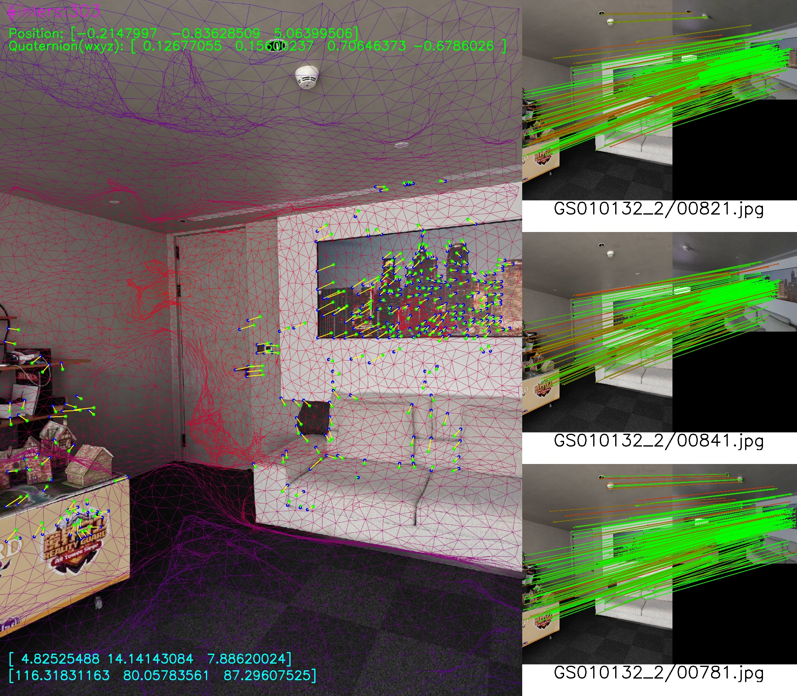
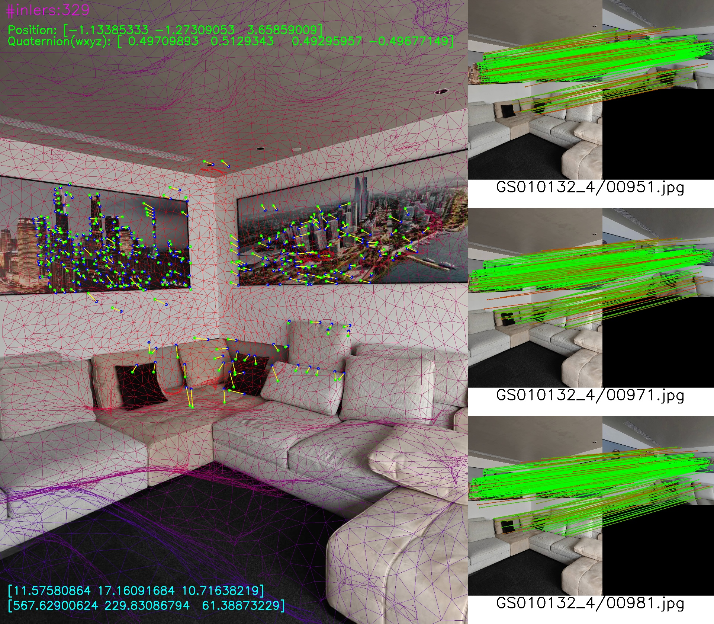

# VisualLocalizationService

gRPC service for visual localization: the server estimates camera pose using a prebuilt map and a Triton-hosted SuperPoint/SuperGlue stack. This repository includes a **test client** (`visual_pose_client.py`) for smoke tests and load experiments.

---

## Prerequisites

1. **Map directory** (`--model_path`): must contain the localization database and assets (see [Map and database preparation](#map-and-database-preparation) and [Bag-of-words retrieval](#bag-of-words-bow-retrieval)).
2. **Triton Inference Server** with the SuperPoint / SuperGlue models expected by this codebase (model names such as `superpoint_trt`; see `visual_pose_service/feature/superpoint.py`). The server connects to Triton at **`--sp_address`** (gRPC).

---

## Map and database preparation

**Building the map and producing the SQLite / COLMAP-style assets used by this service (including paths toward `database_3d.db`) is documented and automated in a separate pipeline:**

[**MapMindAI / EasyGaussianSplatting**](https://github.com/MapMindAI/EasyGaussianSplatting)

That repository provides an end-to-end Gaussian Splatting workflow (e.g. drone / 360 data, Docker or local environment, scripts under `mindmap/`). After the pipeline finishes, you should have a **session / map folder** on disk that your team aligns with what `visual_localizer.py` expects (see `DATABASE_NAME = 'database_3d.db'` and related loading logic in `visual_pose_service/visual_localizer.py`).

Any extra steps to fill poses, 3D points from depth, and keypoints into the database are part of **your mapping pipeline** (or tooling shipped with EasyGaussianSplatting); this service repo does not re-run full map building.

Example of reconstruction result:

<table>
  <tr>
    <td align="center" width="50%"></td>
    <td align="center" width="50%"></td>
  </tr>
</table>


---

## Bag-of-words (BoW) retrieval

**BoW retrieval files are produced by the [EasyGaussianSplatting](https://github.com/MapMindAI/EasyGaussianSplatting) map pipeline** alongside `database_3d.db` and the rest of the map layout. After a successful run, the map root you pass to this service as `--model_path` should already contain what `BowRetireval` in `visual_localizer.py` expects—no separate BoW step is required in the usual workflow.

If you need to **regenerate** retrieval data (e.g. after manual edits to the database, or when debugging), you can run:

```bash
conda activate vlpose
cd visual_pose_service
export PYTHONPATH="$(pwd)"

python retrieval/make_retrieval_db.py --model_path /path/to/your/map
```

---

## Environment with Conda (recommended)

Create and activate an environment, then install Python dependencies:

```bash
conda create -n vlpose python=3.9 -y
conda activate vlpose
cd visual_pose_service
pip install -r requirements.txt
```

On **Linux**, if OpenCV or Open3D fail to load native libraries, install the usual graphics/runtime packages for your distro (for example `libgl1`, `libglib2.0-0`, `libgomp1` on Debian/Ubuntu).

Always run commands from `visual_pose_service` **or** set:

```bash
export PYTHONPATH="/absolute/path/to/VisualLocalizationService/visual_pose_service"
```

---

## Run the visual pose server

### Option A: helper script (recommended)

From `visual_pose_service` after `conda activate` and `pip install -r requirements.txt`:

```bash
chmod +x scripts/run_vlserver.sh   # once
MODEL_PATH=/absolute/path/to/your/map \
SP_ADDRESS=YOUR_TRITON_HOST:8001 \
./scripts/run_vlserver.sh
```

Defaults: `PORT=40010`, `SP_ADDRESS=127.0.0.1:8001`, `POOL_SIZE=4`, `TOP_K=3`. See comment header in `scripts/run_vlserver.sh` for all environment variables.

You can also pass arguments directly to the server (same as `visual_pose_server.py`):

```bash
./scripts/run_vlserver.sh --model_path /path/to/map --sp_address 127.0.0.1:8001 --port 40010
```

### Option B: run Python directly

```bash
conda activate vlpose
cd visual_pose_service
export PYTHONPATH="$(pwd)"

python visual_pose_server.py \
  --model_path /absolute/path/to/your/map \
  --port 40010 \
  --sp_address YOUR_TRITON_HOST:8001 \
  --pool_size 4 \
  --top_k 3
```

The server listens on **`0.0.0.0:<port>`**.

---

## Server CLI reference (`visual_pose_server.py`)

| Argument | Description |
|----------|-------------|
| `--model_path` | Map root directory (must contain `database_3d.db` and related assets used by `VisualLocalizer`) |
| `--port` | gRPC listen port for this service (default `40010`) |
| `--max_workers` | gRPC thread pool size (default `10`) |
| `--log_level` | `DEBUG` / `INFO` / `WARNING` / `ERROR` |
| `--sp_address` | Triton gRPC `host:port` for SuperPoint / SuperGlue |
| `--top_k` | Number of top retrieval images (default `3`) |
| `--log_flag` | `0` — console logging only; `1` — also write debug logs / match images under `--logs_dir` |
| `--logs_dir` | Directory used when `--log_flag` is `1` |
| `--pool_size` | Number of worker processes; each loads one `VisualLocalizer` (default `4`) |

---

## Call the server with the test client

The bundled client is **not** a production SDK; paths and intrinsics are **hard-coded**.

1. Set **`SINGLE_CLIENT_ADDRESS`** / **`MULTI_CLIENTS_ADDRESS`** in `visual_pose_service/visual_pose_client.py` to your server `host:port`.
2. Set **`self.folder`** / **`self.image_path`** to a real image file.
3. Run:

```bash
conda activate vlpose
cd visual_pose_service
export PYTHONPATH="$(pwd)"
python visual_pose_client.py
```

Projection results:

The left side of the image shows the mesh projection result and map point reprojection error, while the right side shows candidate image frames similar to the query image found by the bag-of-words model.

<table>
  <tr>
    <td align="center" width="50%"></td>
    <td align="center" width="50%"></td>
  </tr>
</table>

---

## Production clients

Use **gRPC** and **`GetPoseFromImage`**. Python stubs live under `visual_pose_service/proto/`. Original `.proto` files are not in this repository.

---

## Application Example

Global visual localization service combined with local tracking of VR devices achieves global tracking.


## Related tools (not part of the localization server)

- **Marker pose** — separate gRPC service for fiducial/marker pose: [`visual_pose_service/marker_pose_service/README.md`](visual_pose_service/marker_pose_service/README.md)
