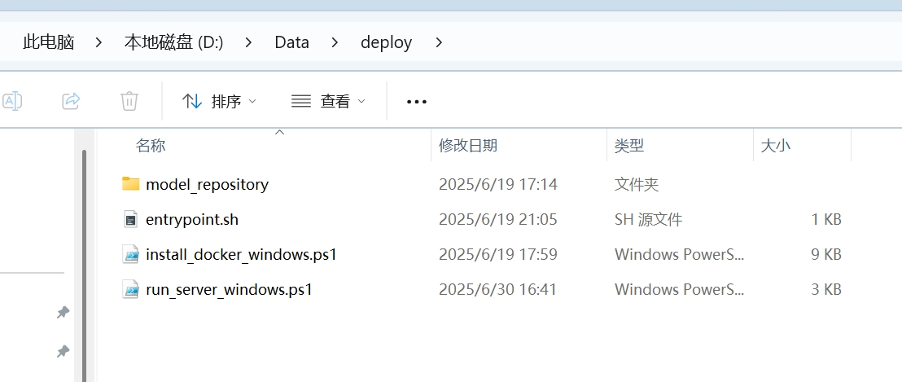

# Visual Pose Service

Visual pose gRPC service and tooling.

## Quick start (Conda)

```bash
conda create -n vlpose python=3.9 -y
conda activate vlpose
cd visual_pose_service
pip install -r requirements.txt
export PYTHONPATH="$(pwd)"
```

Start the server (adjust paths and Triton address):

```bash
python visual_pose_server.py \
  --model_path /path/to/map \
  --sp_address YOUR_TRITON_HOST:8001 \
  --port 40010
```

Test client (after editing addresses/paths in the script):

```bash
python visual_pose_client.py
```

## Preparing map data

### 1. Build map and generate database

Record the environment (e.g. with GoPro) and run the mapping pipeline to produce a localization database.

Pipeline reference: [`https://github.com/deepmirrorinc/GaussianSplatting`](https://github.com/deepmirrorinc/GaussianSplatting).

### 2. Prepare retrieval (BoW)

```bash
python retrieval/make_retrieval_db.py --model_path /path/to/your/map
```

Retrieval preparation may already be integrated in the Gaussian Splatting pipeline.

### 3. Prepare `database_3d`

Fill poses, 3D points (from depth), and keypoints in the database file as required by your pipeline.

```bash
# Parameters are documented in the script
python /path/to/update_map_database.py
```

## Configuration

### Server (`visual_pose_server.py`)

| Argument | Description |
|----------|-------------|
| `--model_path` | COLMAP / map root directory |
| `--port` | gRPC port (default `40010`) |
| `--max_workers` | gRPC thread pool size (default `10`) |
| `--log_level` | `DEBUG` / `INFO` / `WARNING` / `ERROR` |
| `--sp_address` | Triton address for SuperPoint/SuperGlue |
| `--top_k` | Number of retrieval candidates |
| `--log_flag` | `0` console only; `1` also write logs under `--logs_dir` |
| `--logs_dir` | Log directory when `--log_flag` is `1` |

### Test client (`visual_pose_client.py`)

Parameters are mostly hard-coded in the file for local simulation.

When you run `python visual_pose_client.py`, choose `1` for single-client loop or `2` for multi-client stress test.

## Typical workflow

```text
conda activate vlpose
cd visual_pose_service
export PYTHONPATH="$(pwd)"

# Terminal 1
python visual_pose_server.py --model_path ... --sp_address ...

# Terminal 2
python visual_pose_client.py
```

## Networking

Open the host firewall for the chosen gRPC port if clients connect remotely.

Example project layout (data paths vary):


